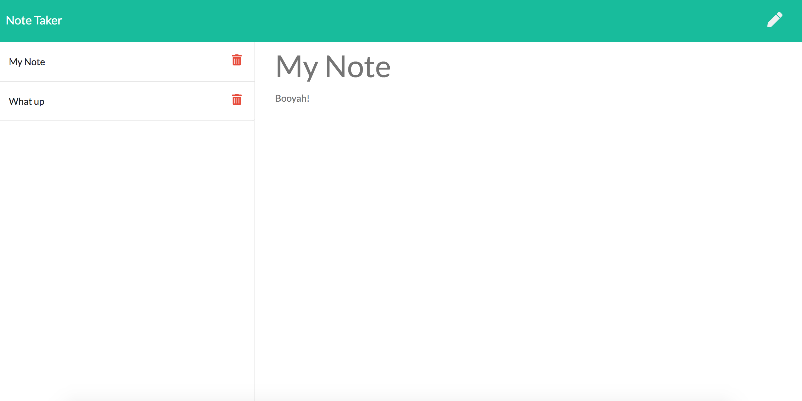

# Note Taker

[Link to deployed application](https://peaceful-island-36686.herokuapp.com/)
## Description
App allows user to write notes, save them for later, and delete them. Deployed live with Heroku. Server built using Node.js and Express.js.
## Installation
Run npm i on your machine to install dependencies.
## License
Licensed under the [WTFPL](http://www.wtfpl.net/about/) license.
